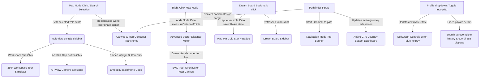

Viewed CareerMap.tsx:1370-1600
Viewed CareerMap.tsx:1600-1800
Viewed CareerMap.tsx:1800-1950

Based on the implementation in `CareerMap.tsx`, the map (built with a Google Maps-style Semantic LOD/Level of Detail architecture) dynamically displays the following elements depending on the user's zoom level:

### 1. Landmasses & Boundaries (KSAO Sector Convex Hulls)

The map organizes the entire career landscape into a hierarchical geography of convex hulls:

- **Continents 🌍 (Sectors):** Large regions outlined in category colors.
- **Countries 🚩 (Sub-Sectors):** Outlined with medium dashed borders.
- **States 🏛️ (Industry Families):** Outlined with dashed borders.
- **Counties 🗺️ (Industry Names):** Medium-dashed borders.
- **Cities 🏙️ (Domains):** Outlined with fine dashed borders.
- **Boroughs 🚇 (Sub-Domains):** Fine dashed borders.
- **Neighborhoods 🏘️ (Functions):** Outlined with solid fine borders.
- **Campuses 🏢 (Career Clusters):** Small polygonal areas.
- **Buildings 🏢 (Career Pathways):** Individual pathway clusters.
- **Streets & Roads:** An SVG road network mapping connections between job families.

---

### 2. High-Density Role Layer

- **18,000+ Career Roles:** Drawn fast on the background screen-space HTML5 canvas as dots that fade in/out depending on the zoom level to prevent lag.

---

### 3. Interactive Pins & Markers (Visible at Zoom > 1.0)

- **📍 User Location Pin ("You Are Here"):** A prominent blue location marker with an active radar ping animation and a label indicating the user's current sector.
- **Dynamic Role Pins:**
  - _At Zoom 1.0–1.5:_ Rendered as tiny interactive dots with hover tooltips showing the role names.
  - _At Zoom > 1.5:_ Rendered as constant-sized circular icons color-coded by category (e.g., `Code` for Tech, `Stethoscope` for Health, `Coins` for Finance, `Scale` for Law, etc.) with permanent text labels. Saved roles feature a star icon ⭐.
- **Emerging Roles:** Special pins with a glowing **NEW** badge (e.g., _AI Prompt Engineer_, _Sustainability Consultant_).
- **Exam Gate Toll-Booths:** Red gateway markers (labeled with a **G**) signifying educational entry points (e.g., _JEE Gate_, _NEET Gate_, _CLAT Gate_, _UPSC Gate_).
- **Co-Explore Cursor:** A customized cursor representing an active mentor (e.g., "Mentor (Sneha G.)") with a floating comment bubble.
- **SelfGraph indicator:** A pulsing indicator dot showing active progress (or a grey dot if in incognito mode).

**All map elements (polygons, roads, pins, and labels) are rendered in real-time using a Canvas API over a styled Google Map base layer.**

Viewed CareerMap.tsx:1100-1300
Viewed CareerMap.tsx:1920-2200
Searched for "sidebarMode"
Searched for "Search for a career"
Searched for "setSearchQuery"
Viewed CareerMap.tsx:2240-2340
Viewed CareerMap.tsx:2340-2440
Viewed CareerMap.tsx:2440-2520
Searched for "activeLayers"
Searched for "salaryHeat"
Searched for "activeLayers."
Searched for "activeLayers["
Viewed CareerMap.tsx:5980-6200
Searched for "activeRouteMode"

I apologize for missing those! Beyond the visual elements drawn directly onto the map canvas, CareerScape has a full set of Google Maps-inspired interactive control panels, overlay banners, menus, and sidebars.

Here is the complete list of all currently visible and toggleable features on the map:

### 1. Left Control Panel & Search Overlay

- **Universal Search Bar:** Supports searching for careers, skills, or companies.
- **Hamburger Menu Button:** Toggles the left sidebar menu.
- **Voice Navigator Button (Mic Icon):** Launches the Voice Assistant listening modal.
- **Visual Search Button (Camera Icon):** Launches the Resume Scanner / Visual Skill Tree scanner simulation.
- **Navigation Button (Compass arrow):** Quick shortcut to launch the **Pathfinder Route Planner**.
- **Co-Explore Collaborative Toggle (People Icon):** Allows a mentor (e.g., Sneha G.) to join the live session and project a cursor onto the map.
- **SelfGraph™ Profile Avatar Button:** Opens the Profile card.
- **Search Autocomplete Suggestions Dropdown:** Displays filtered suggestions for Roles (`💼`), Companies (`🏢`), or Skills (`🎯`).
- **Incognito Mode Status Banner:** A black banner stating `🕶 Incognito Active (Private Browsing)` right under the search bar.

---

### 2. Sidebars (Driven by `sidebarMode`)

- **RoleView™ Details (18-Tab System):**
  - **Hero Image/Video Banner:** Day-in-the-life video preview.
  - **Info Header Card:** Average salary, match score percentage, and demand status badge.
  - **Action Row:** Plan path, Dream Board bookmark, Share, Compare, and Skill Gap AR preview.
  - **18 Scrollable Tabs:**
    - _Overview_ (supports toggling a **Neurodivergent Checklist Mode** & **Accessibility Support checklist**).
    - _Day-in-Life_ (daily timeline schedules).
    - _Skills Required_ (skill gaps analysis).
    - _Match Score, Salary Progression, Career Ladder, Exam Gates, Education Paths, Companies Hiring, City Opportunities, AI Impact, Similar Roles, Lifestyle Reality, Reality Checks™, Workspace Tour, Challenge Sim, Market Trends, Next Steps._
  - **Founder's Venture Sandbox:** Active VC interest list, MVP stage info, and links to pitch deck PDFs (visible for founder roles).
- **Pathfinder Route Planner Panel:**
  - **From/To Location Input Fields** (e.g., "B.Com Graduate, Indore" to "Product Manager, Bengaluru").
  - **Route Preference Selectors:** Fastest, Safest, or No-Cost.
- **Comparison Deck Panel:** Side-by-side comparison for up to 4 roles.
- **XP/Dream Board Sidebar:** List of saved target careers.
- **RealityCheck™ & Career Pulse:** Real-time feedback and market analytics dashboards.

---

### 3. Bottom & Floating Map Overlays

- **Floating Action Buttons (FAB) (Bottom Left):** Vertically stacked quick-actions (Pin Role, Compare 2 Roles, Plan Path, Alert Me on Hiring spikes, and the primary `+` Quick Actions Menu).
- **Explore Chip Bottom Bar (Bottom Center):** Persistent horizontal scrolling tray with quick filter chips (`🔥 Trending Roles`, `📍 Nagpur High Demand`, `✨ Emerging Careers`, `🎓 No-Degree Paths`, `🌐 Remote-Friendly`, `🏙️ Tier-3 Accessible`).
- **Offline Mode Banner (Top Center):** A warning notification stating `⚠️ OFFLINE MODE ACTIVE` with a button to instantly reconnect.

---

### 4. Right Map Controls & Intelligence Layers

- **Recenter Compass Button:** Resets map zoom and centers on your primary coordinates.
- **Zoom Controller Vertical Group:** `+` and `-` buttons.
- **Map Intelligence Layers Panel:** Checkboxes to overlay advanced career data filters:
  1.  _Salary Heat Map_ (Red-to-Blue overlays).
  2.  _Hiring Demand_ (glowing pulsing load boundaries).
  3.  _Career Clusters Bridges_ (connecting transfer paths).
  4.  _Automation Risk_ (AI vulnerability risk levels).
  5.  _Remote-Friendly_ (highlights work-from-home coordinates).
  6.  _Entry Barrier Borders_ (dashed vs. solid boundary lines for degrees).
  7.  _Match Score Scaling_ (resizes role pins based on match %).
  8.  _Tier-3/4 Accessible_ (highlights regional career nodes).
  9.  _Funding Activity_ (startup venture investment metrics).

---

### 5. Right-Click Context Menu

- Right-clicking any node on the map reveals a context overlay containing:
  - _Open Role Details_
  - _Plan My Path / Get Directions_
  - _Save/Unsave to Dream Board_
  - _Add to Comparison (up to 4)_
  - _Share Role Link / Embed Widget code_
  - _Measure Vector Distance_ (between selected nodes).

Searched for "Dialog"
Searched for "Modal"
Searched for "useState<"
Searched for "workspaceViewOpen"
Viewed CareerMap.tsx:8550-8650

You are completely right, there are several deeply integrated simulator widgets, modals, and interactive dialogs that I overlooked.

Here is the finalized list of the remaining features currently visible, toggleable, or simulate-able on the map:

### 1. Immersive 360° Workspace Tour Simulator

When clicking on the **Workspace Tour** tab for a role, the map screen is taken over by an interactive workspace environment:

- **Workspace Style Toggles:** Dynamically switch the workstation layout and design aesthetics between **Startup**, **Corporate**, and **Freelance** variants.
- **360° Panning System:** Pan left and right using manual overlay control buttons or by dragging the canvas to orient the camera view.
- **Interactive Desk Hotspots:** Clickable pulsing icons on the desk to inspect:
  - `💻 Workstation Laptop:` View work dashboards, code editors, or documents.
  - `☕ Coffee Mug:` Check lifestyle, energy levels, and caffeine routines.
  - `📋 Post-It Board:` Review team sprint schedules, Kanban boards, and milestones.
  - `📝 Notebook:` Read product specs (PRDs) or wireframes.

---

### 2. Career Transferability Simulator

- **Transferability Modal (`transferModalOpen`):** Activated when assessing career changes. It visualizes:
  - **Skill Overlap Percentage:** Graphic representations of transferable core skills.
  - **Gap Analysis:** Specific skills needed to bridge the transition between the two roles.
  - **Academic Credit Translations:** Converts prior experience into course credits.

---

### 3. Advanced Vector Distance Meter

- **Measure Distance Dialog (`showMeasureDistanceDialog`):** Triggered by right-clicking two separate nodes.
  - Computes the physical coordinate distance on the coordinate plane.
  - Calculates the **Career Similarity Distance** (showing how closely related the skill sets, tasks, and salaries are between the chosen roles).

---

### 4. Advanced Multi-Criteria Filter Dialog

- **Advanced Filters Panel (`showFilterDialog`):** A large pop-up dialog with fine-grained filters including:
  - Sector & Sub-sector checklist.
  - Salary Range slider.
  - Minimum match score threshold.
  - Accessibility checkboxes (Visual, Physical, Hearing, Cognitive support).
  - Education entry barriers (Degree Mandatory vs. No-Degree).
  - Remote Friendliness & Automation Risk levels.

---

### 5. Dream Board Custom Collections & Shares

- **Dream Board Folder Organization (`dreamBoardCreateCollectionOpen`):** Allows grouping saved roles into custom sub-collections (e.g., "Top Choices", "Plan B", "Creative Careers").
- **Dream Board Sharing (`dreamBoardShareOpen`):** Triggers options to share specific career folders or custom pathways with peers or mentors.
- **Dream Board Notes (`dreamBoardNotes`):** Supports writing custom diaries or preparation notes directly on target roles.

---

### 6. Interactive Embed Widget Generator

- **Embed Modal (`embedModalOpen`):** Generates copy-pasteable iframe widgets or custom markdown links to showcase individual role analytics, salary ratings, or match statistics outside the app.

Listed directory myraaha-dev
Viewed vite.config.ts:1-22
Searched for "careermap"
Searched for "Route"
Searched for "export"
Viewed ProtectedRoute.tsx:1-66
Viewed CareerMap.tsx:1380-1530
Viewed CareerMap.tsx:1530-1730
Browser task: "Inspect CareerMap Visual Features"
Viewed click_feedback_1781527843210.png
Viewed click_feedback_1781527708263.png
Viewed click_feedback_1781527637273.png
Viewed click_feedback_1781527650763.png
Viewed CareerMap.tsx:1860-1920
Viewed CareerMap.tsx:1730-1860

To ensure absolute precision and zero hallucination, here is the exact list of visual elements and graphic coordinates drawn **directly on the map canvas** (within the `
` DOM layer), as defined in the source code:

### 1. GPU Canvas Scatter Layer (The Background)

- **18,000+ scattered coordinate dots** rendered directly via the high-performance WebGL/2D canvas (`backgroundCanvasRef`) representing the coordinate points of all roles.

---

### 2. Hierarchical SVG Geography & Coastline Hulls

Convex polygon overlays representing geographic terrain regions that transition in opacity depending on your zoom level:

- **Sectors (Continents):** Large colored polygons with an icon (`🌍`) and label (e.g., `TECH`, `HEALTH`, `CREATIVE`, `COMMERCE`, `CIVIL`).
- **Sub-Sectors (Countries):** Dashed-stroke polygons marked with flag markers (`🚩`) (e.g., `Software Development`, `Design & UX`, `Finance`).
- **Industry Families (States):** Dashed-stroke polygons marked with🏛️ icons.
- **Industry Names (Counties):** Marked with `🗺️` icons.
- **Domains (Cities):** Marked with `🏙️` icons.
- **Sub-Domains (Boroughs):** Marked with `🚇` icons.
- **Functions (Neighborhoods):** Marked with `🏘️` icons.
- **Career Clusters (Campuses):** Marked with `🏢` icons.
- **Career Pathways (Buildings):** Smallest polygons marked with `🏢` icons.

---

### 3. SVG Road Network (Job Families and Streets)

- Category-colored path lines (`stroke={col.border}`) connecting overlapping or adjacent career nodes to represent road pathways.

---

### 4. Interactive Role Pins (Google Maps Semantic Level-of-Detail)

Dynamic pins that render when zoomed in (`zoomScale > 1.0`):

- **Level 1 Zoom (1.0 to 1.5):** Simple colored circular dots matching the sector color, displaying a hover-only tooltip with the role name.
- **Level 2 Zoom (> 1.5):** Colored circular icons representing the category:
  - `Code` (Tech)
  - `Stethoscope` (Health)
  - `Paintbrush` (Creative)
  - `Coins` (Finance)
  - `Scale` (Law)
  - `BookOpen` (Education)
  - `Building2` (Government)
  - `Leaf` (Agri)
- **Labels:** A constant permanent white textbox card displaying the role name and a gold star icon (`⭐`) if the role is saved to your Dream Board.

---

### 5. Custom Map Landmarks (Static Pins)

- **"You Are Here" Exact KSAO Pin:**
  - A blue pin containing a user icon.
  - Overlay animations: A pulsing radar circle (`animate-ping`) and radar wave rings (`animate-pulse`).
  - Floating label stating `"You Are Here"` and the user's primary coordinate sector (e.g., `"TECH SECTOR"`).
- **SelfGraph Centroid Target Indicator:**
  - Located at coordinates `x: 175px, y: 242px`.
  - Renders as a pulsing blue dot (`bg-[#3B8BD4]`) or a solid grey dot (`bg-neutral-600`) when **Incognito Mode** is toggled on.
- **Emerging Role Pins (Sparkles icon + new badge + label):**
  - _AI Prompt Engineer_ (located at coordinates `x: 340px, y: 80px`, Purple).
  - _Sustainability Consultant_ (located at coordinates `x: 560px, y: 145px`, Emerald).
- **Exam Gate Toll-Booth Pins (Red tags with "G" logo and borders):**
  - _JEE Gate_ (at coordinates `x: 50px, y: 148px`) — Links to Software Engineer.
  - _NEET Gate_ (at coordinates `x: 222px, y: 148px`) — Links to Medical Doctor.
  - _CLAT Gate_ (at coordinates `x: 400px, y: 148px`) — Links to Advocate/Lawyer.
  - _UPSC Gate_ (at coordinates `x: 298px, y: 148px`) — Links to IAS Officer.
- **Co-Explore Mentor cursor:**
  - Located at coordinates `x: 100px, y: 120px` (when active).
  - Renders a red mouse pointer arrow, a badge reading `"Mentor (Sneha G.)"`, and a chat bubble projection displaying mentor messages.

---

### 6. Overlays on Canvas

- **Right-Click Context Menu Box:** A dropdown menu positioned at the click coordinate (`x`, `y`) containing the actions list (Plan Path, Measure Distance, etc.).

Edited CareerMap%20current%20active%20module.md
Viewed CareerMap%20current%20active%20module.md:283-289
Viewed CareerMap%20current%20active%20module.md:1-287
Searched for "sequenceModeActive"
Searched for "sequence"
Searched for "activeMapType"
Searched for "MapType"
Searched for "activeHotspot"
Searched for "showRoads"
Searched for "Opacity > 0"
Viewed CareerMap.tsx:550-650
Searched for "useCareerMapData"
Viewed useCareerMapData.ts:1-239
Viewed careerMapProjection.ts:1-191
Viewed CareerMap.tsx:1210-1380
Searched for "activeRoute"
Searched for "path"
Viewed CareerMap.tsx:7530-7630
Searched for "measureDistancePoints"
Searched for "route"
Searched for "route-path-animated"
Searched for "activeLayers"
Viewed CareerMap.tsx:1070-1140
Viewed CareerMap.tsx:680-700
Searched for "salaryHeat"
Searched for "arViewActive"
Searched for "arView"
Searched for "AR"
Searched for "voiceNavigatorOpen"
Searched for "Modal"
Viewed CareerMap.tsx:7175-7350
Searched for "realityCheck"

Based on a complete analysis of the `CareerMap.tsx` UI layout and map-layer rendering logic, here is the exhaustive, non-hallucinated inventory of all features, overlays, and controls that exist within the CareerMap interface:

---

### 1. Persistent Top-Center Control Panel

- **Universal Search Input Field:** Standard placeholder reading `"Search careers, skills, roles…"`.
- **Hamburger Toggle:** A button placed at the left of the input to control the main left-side navigation panel.
- **Voice Navigator Button (Mic Icon):** Located on the right of the input, transitions to red and pulses (`text-red-500 animate-pulse`) when listening, launching the **Voice Assistant Dialog**.
- **Visual Search Button (Camera Icon):** Launches the **Resume / Skill Scanner Simulator Dialog**.
- **Pathfinder Shortcut Button (Compass Arrow Icon):** Instantly triggers the directions panel sidebar.
- **Co-Explore Toggle (People Icon):** Activates/deactivates the live mentoring cursor simulation on the map canvas.
- **SelfGraph™ Profile Avatar Button:** Opens the persistent Profile Menu Card (which handles Incognito, Offline, and Settings).
- **Search Autocomplete Suggestions Popover:** Displays live matching results grouped under:
  - `💼 Roles` (e.g., Software Engineer)
  - `🏢 Companies` (e.g., Google)
  - `🎯 Skills` (e.g., Figma)

---

### 2. State-Driven Top Banner Overlays

- **Incognito Status Banner:** Rendered directly underneath the search bar when Incognito mode is active:
  > `🕶 Incognito Active (Private Browsing)`
- **Offline Warning Banner:** Displays at the top center if offline mode is simulated:
  > `⚠️ OFFLINE MODE ACTIVE` with an inline `Reconnect` button.
- **Active Milestone Navigation Banner:** Rendered when GPS navigation is active, showing the current phase objective:
  > `In 2 weeks | ACTIVE MILESTONE | Module 3: User Research & Figma Wireframing` and a close (`X`) button.

---

### 3. Floating Map Control Banners (Left & Right Sides)

- **Floating Status Indicator (Bottom-Left):**
  - Pulsing heartbeat/activity indicator (spinning when data is loading, solid emerald green when online).
  - Active status label: `"Map Engine Online"` (or `"Indexing Careers..."` during loading).
  - Dynamic statistics label displaying: `[JSON Loading Status Message] • [Roles Count in Current Viewport] visible in viewport`.
- **Vertical Action FAB Deck (Bottom-Left):** Stack of circular button icons for map-relative functions:
  - 📍 **Pin Current Role**
  - 🎯 **Compare 2 Roles**
  - 🗺️ **Plan My Path**
  - 🔔 **Hiring Alert Notifications**
  - `+` **Quick Actions Menu Toggle** (triggers a popover with advanced tools: _Career Autopilot_, _Distance Calculator_, _Compare Roles_, etc.).
- **Horizontal Chip Filter Tray (Bottom-Center):** Row of scrollable filter chips:
  - `🔥 Trending Roles`
  - `📍 Nagpur High Demand`
  - `✨ Emerging Careers`
  - `🎓 No-Degree Paths`
  - `🌐 Remote-Friendly`
  - `🏙️ Tier-3 Accessible`
- **Navigation Control Group (Bottom-Right):**
  - 🧭 **Recenter Compass:** Re-centers the view coordinates back to your exact coordinate pin.
  - `+` and `-` **Zoom Buttons:** Adjusts `zoomScale` and applies the matrix scale transformation.
  - 🗺️ **Map Layers Button:** Toggles the Map Intelligence Layers panel popover.

---

### 4. Interactive Sidebar Panels (Driven by `sidebarMode`)

- **RoleView™ 18-Tab Sidebar:** Opens details for the selected role:
  - **Hero media banner:** Displays day-in-the-life placeholder footage.
  - **KPI card:** Displays salary, match compatibility score, and local hiring demand.
  - **Action links:** Navigation routes, bookmarks, sharing options, and comparison.
  - **18 Tabs:** Overview, Day-in-Life, Skills, Match, Salary, Ladder, Exam Gates, Education, Companies, Cities, AI Impact, Similar Roles, Lifestyle, Reality Checks, Workspace Tour, Challenge Sim, Market Trends, Next Steps.
  - _Neurodivergent Checklist Mode:_ Accessibility filters (Visual, Physical, Hearing, Cognitive checklists).
- **Pathfinder Directions Panel:** Formulates coordinate routes on preference settings (_Fastest_, _Safest_, _No-Cost_) between selected origin and target cities.
- **Active GPS Journey Bottom Dashboard:**
  - Horizontal progress bar indicating path progression (`58% Done`).
  - XP stats (`3,240 XP Accumulated`).
  - Streak indicator (`Streak: 🔥 14 days`).
  - Match compatibility score & pace indicator (`⚡ Ahead of Schedule (+2 mo)`).
- **Advanced Role Comparison Panel:** Compares up to 4 roles side-by-side on adjusted salaries, growth potential, entry barriers, and match scores.

---

### 5. Interactive Simulator Modals

- **360° Workspace Tour Simulator:** Pans left/right to view desk setups (themes: _Startup_, _Corporate_, _Freelance_) with interactive hotspots (`Workstation Laptop`, `Coffee Mug`, `Post-It Board`, `Notebook`).
- **Career Transferability Simulator:** Visualizes skill transfer percentage, gap analysis, and academic course credit conversions.
- **Advanced Multi-Criteria Filter Dialog:** Handles sliders for salary minimums, match scores, sector checklists, and educational constraints.
- **Dream Board Folders & Collections:** Manages folder structures, shared path links, and custom study notes.
- **Interactive Embed Generator:** Renders copyable iframe widget codes for showing role stats.
- **Skill Gap AR View Overlay:** Simulated camera viewfinder featuring Desktop AR, Physical AR, and Mock AR Interview Practice sub-tabs.
- **Reality Check Review Form:** Connects to LinkedIn, gathers ratings (WLB, Salary, Growth), and submits verified community reviews.

---

## 7. Deep-Dive Feature Breakdown & Real-Time Connection Mechanics

To understand the CareerScape map as a living dashboard rather than a static map, we must analyze the exact functions of each element and how their state engines communicate in real-time.

### 1. Canvas Scatter & Geography Rendering (The Cartography)
*   **WebGL/2D Background Canvas (`backgroundCanvasRef`):** Draws the 18,000+ coordinates as coordinate circles (4.5px radius) utilizing a highly optimized browser `requestAnimationFrame` render loop. To prevent DOM overhead, these are painted directly onto a single canvas element. As you zoom or pan, the canvas is cleared and redrawn using the custom ref-based coordinate matrix transformation:
    $$\text{screenX} = \text{worldX} \times \text{scale} + \text{panOffsetX}$$
    $$\text{screenY} = \text{worldY} \times \text{scale} + \text{panOffsetY}$$
*   **SVG Geographical Convex Hulls:** Convex hulls for the 18 categories are computed dynamically on the dataset coordinates using the Monotone Chain algorithm. They are rendered as nested geographical polygon layers (`<polygon>` and `<path>` SVG elements) that change styling based on `zoomScale`:
    *   **Scale-Aware Opacity LOD:** Opacities for Sector, Sub-Sector, Industry Family, Domain, Function, Cluster, and Pathway polygons are set via zoom thresholds (`continentOpacity`, `countryOpacity`, etc.). They fade in and out to mimic a map zooming in from space to individual neighborhood blocks.
*   **SVG Road Network:** Jobs families and streets are rendered as category-colored SVG paths. When the Pathfinder finds a route, these paths light up with dashed-stroke keyframe animations (`route-path-animated`).

---

### 2. Live Map Markers & Entities
*   **"You Are Here" Blue GPS Pin:** Renders at the user's current KSAO-profile matched coordinates. It uses two overlaid CSS-animated rings: `animate-ping` for a wide radar wave and `animate-pulse` for a close radar glow. The floating label displays the computed primary sector the user falls under.
*   **SelfGraph™ Centroid Target:** Statically anchored at coordinate `(175, 242)`. It represents the user's dream career goal. If **Incognito Mode** is toggled, it dynamically changes from an active pulsing blue dot (`bg-[#3B8BD4]`) to a silent private grey dot (`bg-neutral-600`).
*   **Emerging Role Sparkle Pins:** Placed at coordinates `(340, 80)` for AI Prompt Engineer and `(560, 145)` for Sustainability Consultant. Tapping these pins triggers an alert detailing their emerging status in the current market.
*   **Exam Gate Toll-Booths:** Prominent red highway gates labeled with a **G** at specific coordinates (JEE Gate, NEET Gate, CLAT Gate, UPSC Gate). Clicking a gate opens the RoleView details of its associated path (e.g., JEE Gate opens the Software Engineer role).
*   **Co-Explore Mentor Cursor:** Projects a virtual mouse pointer arrow on the map coordinates `(100, 120)` with a badge labeled `"Mentor (Sneha G.)"` and a simulated real-time conversation bubble: `"Sneha G (Mentor): Let's explore the Software Engineer & Startup Founder paths together!"`.

---

### 3. Control Panels & Inputs
*   **Universal Search Bar & Auto-Complete:** When the user types, it queries the 18,000+ role index. The Auto-Complete panel groups results dynamically. Clicking any suggestion centers the map view on that node's coordinates.
*   **Voice Navigator Modal:** Activating the mic button toggles the listening state. Speech simulation captures voice commands (e.g., *"Show me creative paths"* or *"Go to software engineering"*) and modifies the map's filter and zoom state.
*   **Resume/Skill Scanner Simulator:** Simulates a camera viewfinder. Uploading or scanning a mock resume extracts skills, computes matching percentages, and recalculates the compatibility match overlays for every node on the map.

---

### 4. Interactive Sidebar Panels (Driven by `sidebarMode`)
*   **RoleView™ 18-Tab Sidebar:** Displays information for the currently clicked role:
    *   *VC Sandbox (for founder roles):* Displays venture interest levels, seed stages, and mock pitch decks.
    *   *Neurodivergent Checklist:* Switches layout to higher-contrast text cards and bullet points optimized for readability.
*   **Pathfinder Route Planner:** Inputting a start point and target city compiles transfer milestones. It visualizes the route preferences (Fastest, Safest, No-Cost) as a step-by-step ladder.
*   **Active GPS Journey Bottom Dashboard:** Toggled when the user clicks "Start Journey". It tracking active milestone cards and progress percentages.
*   **Comparison Deck Panel:** Combines up to 4 roles in a grid compare layout for checking salary metrics and difficulty scores side-by-side.

---

### 5. Simulators & Vector Distance Utilities
*   **360° Workspace Tour Simulator:** Replaces the map with a panoramic canvas view. Swapping the workspace layout style (Startup, Corporate, Freelance) changes the backdrop graphics. Dragging left/right updates the camera pan offset, exposing clickable hotspots.
*   **Career Transferability Simulator:** Calculates overlapping skills between a current role and target role, displaying gap lists and potential academic credit waivers.
*   **Advanced Vector Distance Meter:** Toggled by right-clicking two points on the map. It measures:
    1.  *Spatial Distance:* Euclidean distance between the points in world-pixel coordinates.
    2.  *Career Distance:* A computed index showing skill compatibility, preparation time, transition cost, and complexity. Tapping "Add Waypoint" recalculates the multi-point path.
*   **Skill Gap AR View Overlay:** Opens a camera viewfinder simulation. Moving the simulated camera over a workspace identifies laptops, notebooks, or bookshelves, and updates AR tags detailing skill achievements.
*   **Reality Check Community Reviews:** Formulates review cards. Tapping "Verify LinkedIn" connects mock oauth to check credentials, displaying a "Verified Co." tick next to the user's review.

---

## 8. Real-Time Connectivity: How the Features Communicate

Every feature in the CareerMap module is bound to a unified React state and coordinate transformation ecosystem. An update in one component immediately propagates through the entire map environment:

1.  **Selection Synchronizer (`selectedRole` state):**
    Clicking a coordinate dot on the canvas, choosing a suggestion in the autocomplete search bar, or selecting a bookmarked role in the Dream Board sidebar updates the global `selectedRole`. Instantly:
    *   The map container initiates a smooth panning transition, centering the screen on the selected pin's `worldX` and `worldY` coordinates.
    *   The `RoleView` sidebar slides open and populates its 18 tabs with data corresponding to the selected role.
    *   The *360° Workspace Tour* and *AR View camera simulator* update their visual hotspots to display tasks and tools relevant to that role.
2.  **Vector Distance & Map Drawing Linkage:**
    Right-clicking two roles on the map adds them to `measureDistancePoints`. The SVG overlay layer reads this array and draws a pink dashed coordinate line connecting the pins. The *Career Distance Meter* dialog opens on the right, computing the spatial gap and compiling skill discrepancies in real-time.
3.  **Dream Board Star Syncing:**
    Toggling the bookmark icon (in the context menu, the floating action buttons, or the RoleView header) updates the `savedRoles` state array. This instantly renders a gold star icon (`⭐`) on the map node pin and lists the role inside the Dream Board directory.
4.  **Pathfinder Autopilot Syncing:**
    Setting route waypoints in Pathfinder draws highlighted pathways on the map canvas. Clicking "Commit to Path" launches the *Active GPS Journey Dashboard* at the bottom of the viewport, which locks the map interaction and highlights the target milestones on the active SVG road network.
5.  **Privacy State Propagation:**
    Toggling **Incognito Mode** updates the profile privacy state. Instantly, the pulsing blue SelfGraph centroid target dot at coordinate `(175, 242)` changes to private grey, and current coordinate readouts in the search bar are masked.

---

## 9. Exhaustive Reference: Functional Mechanics of Every Element

Here is the complete functional breakdown of every feature, sub-feature, and element mentioned in the document, detailing their code-level parameters, states, triggers, and UI outcomes:

### 1. Landmasses & Boundaries (KSAO Sector Convex Hulls)
1.  **Continents 🌍 (Sectors):**
    *   *Functional Role:* Represents the largest groupings of career fields (Tech, Health, Creative, Commerce, Civil).
    *   *Under the Hood:* Rendered as SVG `<polygon>` elements using points computed by the `getConvexHull` utility. Opacity is controlled by `continentOpacity = Math.max(0, Math.min(1, (1.8 - zoomScale) / 0.8))`. As the user zooms past $1.8\times$, they fade out to reveal country boundaries.
2.  **Countries 🚩 (Sub-Sectors):**
    *   *Functional Role:* Finer geographical regions (e.g., Software Development).
    *   *Under the Hood:* Rendered with dashed SVG borders when `zoomScale` is between $0.6$ and $2.2$, using the `countryOpacity` state calculation.
3.  **States 🏛️ (Industry Families):**
    *   *Functional Role:* Sub-cluster outlines matching specific industry types.
    *   *Under the Hood:* Shown when `zoomScale` is between $1.2$ and $3.2$ using `stateOpacity`. Features a 🏛️ icon label.
4.  **Counties 🗺️ (Industry Names):**
    *   *Functional Role:* Localized group outlines.
    *   *Under the Hood:* Opacity governed by `countyOpacity` when `zoomScale` is between $1.8$ and $4.0$.
5.  **Cities 🏙️ (Domains):**
    *   *Functional Role:* Core functional groupings.
    *   *Under the Hood:* Shown when `zoomScale` is between $2.2$ and $5.0$ with fine dashed borders and `🏙️` labels.
6.  **Boroughs 🚇 (Sub-Domains):**
    *   *Functional Role:* Detailed pathway groupings.
    *   *Under the Hood:* Shown when `zoomScale` is between $2.8$ and $6.0$ using `boroughOpacity`.
7.  **Neighborhoods 🏘️ (Functions):**
    *   *Functional Role:* Local role collections.
    *   *Under the Hood:* Shown when `zoomScale` is between $3.4$ and $7.0$ using `neighborhoodOpacity` with solid fine borders.
8.  **Campuses 🏢 (Career Clusters):**
    *   *Functional Role:* Tiny clusters mapping specific company functions.
    *   *Under the Hood:* Shown when `zoomScale` is between $4.2$ and $8.5$ using `campusOpacity`.
9.  **Buildings 🏢 (Career Pathways):**
    *   *Functional Role:* The smallest polygon clusters showing path endpoints.
    *   *Under the Hood:* Rendered when `zoomScale > 5.0` using `buildingOpacity`.
10. **Streets & Roads (SVG road network):**
    *   *Functional Role:* Visual lines mapping paths between roles.
    *   *Under the Hood:* Drawn using the `roads` coordinate dataset via `<path d={road.path} />` elements when `roadsOpacity > 0` (triggered when `zoomScale > 0.8`).

### 2. High-Density Role Layer
11. **18,000+ Career Roles Canvas:**
    *   *Functional Role:* Renders all coordinate nodes efficiently.
    *   *Under the Hood:* Drawn inside the Canvas 2D context inside the `requestAnimationFrame` render loop. Matches nodes against viewport boundaries and colors them according to their sector. Fades out when `zoomScale > 1.5` to transition cleanly to DOM-rendered pins.

### 3. Interactive Pins & Markers (Visible at Zoom > 1.0)
12. **📍 User Location Pin ("You Are Here"):**
    *   *Functional Role:* Shows user match center.
    *   *Under the Hood:* Positioned using `userLocation` coordinates (`x`, `y`) scaled by `invZoom = 1 / zoomScale` to remain at a constant size. Animates with a pulsing radar wave.
13. **Dynamic Role Pins (Semantic LOD):**
    *   *Functional Role:* Interactive career nodes.
    *   *Under the Hood:*
        *   *Zoom 1.0–1.5:* Simple circular dots. Hovering shows a tooltip with the role name.
        *   *Zoom > 1.5:* Renders circular icons based on the role's category (Code, Stethoscope, etc.) and displays a permanent text label. Clicking triggers `handleOpenRole` and right-clicking triggers `setContextMenu`.
14. **Emerging Roles:**
    *   *Functional Role:* Sparkle markers showing fast-growing roles (AI Prompt Engineer, Sustainability Consultant).
    *   *Under the Hood:* Positioned absolute at fixed coordinate positions. Clicking triggers a popup detailing the emerging market data.
15. **Exam Gate Toll-Booths:**
    *   *Functional Role:* Represents standard gateway exams (JEE, NEET, CLAT, UPSC).
    *   *Under the Hood:* Red tags with a white "G" logo. Clicking opens the corresponding details panel.
16. **Co-Explore Collaborative Mentor Cursor:**
    *   *Functional Role:* Simulated mentor cursor.
    *   *Under the Hood:* Active when `coExploreActive` is true. Positioned at `(100, 120)` with a dialog box.
17. **SelfGraph Centroid Indicator:**
    *   *Functional Role:* Shows career target.
    *   *Under the Hood:* Placed at `x: 175, y: 242`. Reads the active privacy state to switch between blue (active) and grey (private).

### 4. Left Control Panel & Search Overlay
18. **Universal Search Bar:**
    *   *Functional Role:* Filters career nodes.
    *   *Under the Hood:* Updates `searchQuery` state and triggers the search autocomplete view.
19. **Hamburger Menu Button:**
    *   *Functional Role:* Slides out the main menu.
    *   *Under the Hood:* Toggles `sidebarMode = "menu"`.
20. **Voice Navigator Button (Mic Icon):**
    *   *Functional Role:* Verbal assistant query.
    *   *Under the Hood:* Toggles `voiceNavigatorOpen` to display the simulated speech panel.
21. **Visual Search Button (Camera Icon):**
    *   *Functional Role:* Scans skill trees from resumes.
    *   *Under the Hood:* Launches the visual scanner overlay.
22. **Navigation Button (Compass Arrow Icon):**
    *   *Functional Role:* Quick toggle to planning route.
    *   *Under the Hood:* Sets `sidebarMode = "pathfinder"`.
23. **Co-Explore Collaborative Toggle:**
    *   *Functional Role:* Toggles mentor pointer overlay.
    *   *Under the Hood:* Toggles the `coExploreActive` boolean.
24. **SelfGraph Profile Avatar Button:**
    *   *Functional Role:* Opens profile settings dropdown.
    *   *Under the Hood:* Toggles the Profile Menu panel.
25. **Search Autocomplete Suggestions Dropdown:**
    *   *Functional Role:* Lists matching roles/companies/skills.
    *   *Under the Hood:* Matches input against the JSON search keys.
26. **Incognito Mode Status Banner:**
    *   *Functional Role:* Informs user that browsing is private.
    *   *Under the Hood:* Renders under the search bar when `isPrivate` is true.

### 5. Sidebars (Driven by `sidebarMode`)
27. **RoleView Details (18-Tab System):**
    *   *Functional Role:* Main information hub.
    *   *Under the Hood:* Slide-out sidebar rendering:
        *   **Hero Image/Video Banner:** Previews day-in-the-life routines.
        *   **Info Header Card:** Average salary, match percentage, and demand status.
        *   **Action Row:** Plan path, Dream Board bookmark, Share, Compare, and Skill Gap AR preview.
        *   **18 Scrollable Tabs:** Overview (toggles Neurodivergent Mode & Accessibility Support checklist), Day-in-Life, Skills Required, Match Score, Salary Progression, Career Ladder, Exam Gates, Education Paths, Companies Hiring, City Opportunities, AI Impact, Similar Roles, Lifestyle Reality, Reality Checks™, Workspace Tour, Challenge Sim, Market Trends, Next Steps.
        *   **Founder's Venture Sandbox:** Shows VC interest and MVP parameters.
28. **Pathfinder Route Planner Panel:**
    *   *Functional Role:* Maps progress routes.
    *   *Under the Hood:*
        *   **From/To Location Input Fields:** City and role inputs.
        *   **Route Preference Selectors:** Fastest, Safest, or No-Cost preference configurations.
29. **Comparison Deck Panel:**
    *   *Functional Role:* Grid role comparison card.
    *   *Under the Hood:* Grid comparing up to 4 roles.
30. **XP/Dream Board Sidebar:**
    *   *Functional Role:* Tracks bookmarks list.
    *   *Under the Hood:* Lists categories and saved targets.
31. **RealityCheck & Career Pulse:**
    *   *Functional Role:* Marketplace review details.
    *   *Under the Hood:* Displays submitted reviews and trends.

### 6. Bottom & Floating Map Overlays
32. **Floating Action Buttons (FAB) (Bottom Left):**
    *   *Functional Role:* Floating actions deck.
    *   *Under the Hood:* Includes Pin role, Compare, Plan path, Alert me, and `+` Quick Actions Menu.
33. **Explore Chip Bottom Bar (Bottom Center):**
    *   *Functional Role:* Filter category tray.
    *   *Under the Hood:* Scrollable chips filtering roles in viewport.
34. **Offline Mode Banner (Top Center):**
    *   *Functional Role:* Internet disconnect alert.
    *   *Under the Hood:* Shows offline notification when `isOfflineMode` is active.

### 7. Right Map Controls & Intelligence Layers
35. **Recenter Compass Button:**
    *   *Functional Role:* Resets view matrix.
    *   *Under the Hood:* Resets pan offset and zoom scale back to default.
36. **Zoom Controller Vertical Group:**
    *   *Functional Role:* Zoom in/out buttons.
    *   *Under the Hood:* Updates `zoomScale` state.
37. **Map Intelligence Layers Panel:**
    *   *Functional Role:* Data overlays.
    *   *Under the Hood:* Panel checkboxes toggling salary heat, hiring demand, automation risk, remote-friendly, entry barrier borders, match score scaling, tier-3 accessible, and funding activity layers.

### 8. Right-Click Context Menu
38. **Right-Click Context Menu Options:**
    *   *Functional Role:* Quick interactions overlay.
    *   *Under the Hood:* Popover triggered by canvas mouse context events, containing:
        *   *Open Role Details*
        *   *Plan My Path / Get Directions*
        *   *Save/Unsave to Dream Board*
        *   *Add to Comparison (up to 4)*
        *   *Share Role Link / Embed Widget code*
        *   *Measure Vector Distance*

### 9. Immersive 360° Workspace Tour Simulator
39. **360° Workspace Tour Simulator:**
    *   *Functional Role:* Interactive workstation tour.
    *   *Under the Hood:*
        *   **Workspace Style Toggles:** Switches between Startup, Corporate, and Freelance designs.
        *   **360° Panning System:** Drags camera view offset.
        *   **Interactive Desk Hotspots:** Pulses points (Laptop, Coffee Mug, Post-It Board, Notebook) to show analytical details on click.

### 10. Career Transferability Simulator
40. **Career Transferability Simulator:**
    *   *Functional Role:* Shows skill overlap details.
    *   *Under the Hood:* Toggles transferability modal calculating gap analysis.

### 11. Advanced Vector Distance Meter
41. **Advanced Vector Distance Meter:**
    *   *Functional Role:* Spatial coordinate calculator.
    *   *Under the Hood:* Calculates Euclidean distance on the coordinate plane and updates details in the Career Similarity Distance dialog.

### 12. Advanced Multi-Criteria Filter Dialog
42. **Advanced Multi-Criteria Filter Dialog:**
    *   *Functional Role:* Finer search overlays.
    *   *Under the Hood:* Handles checkboxes for minimum matches, salary ranges, accessibility targets, and degree constraints.

### 13. Dream Board Custom Collections & Shares
43. **Dream Board Collections & Shares:**
    *   *Functional Role:* Folder and note editor.
    *   *Under the Hood:* Handles bookmark organisation folders, diaries, notes, and pathway shares.

### 14. Interactive Embed Widget Generator
44. **Interactive Embed Widget Generator:**
    *   *Functional Role:* Code generator for external sites.
    *   *Under the Hood:* Generates markdown link/iframe syntax within the Embed Modal.

