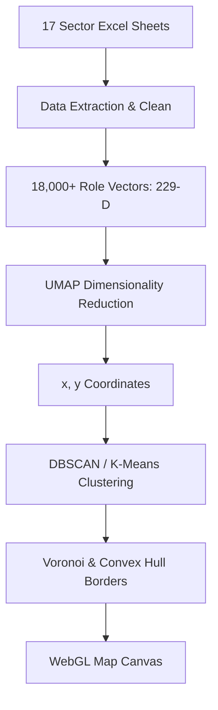
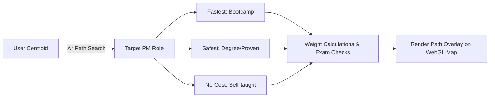
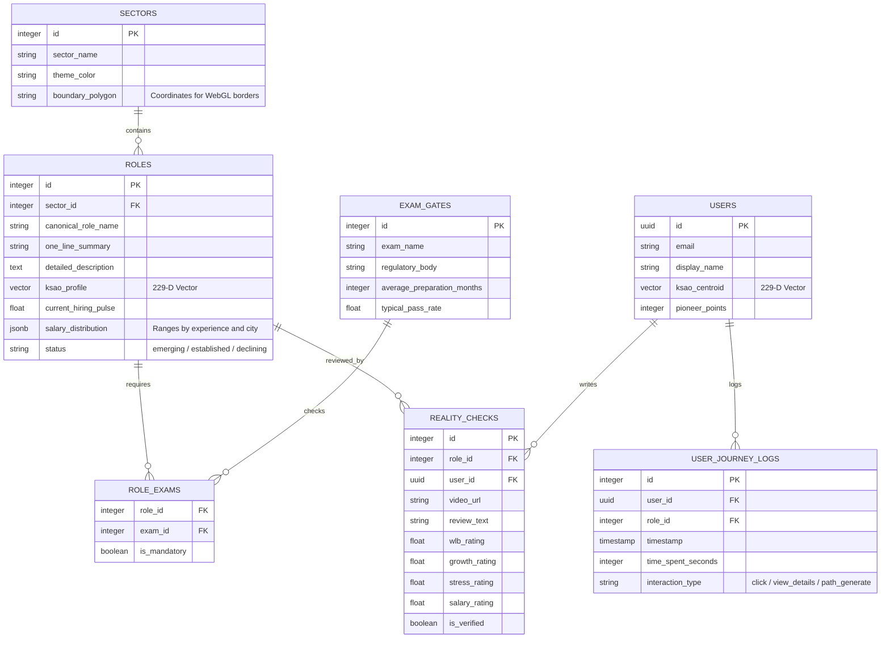

# CareerMap / CareerScape: Spatial Navigation Architecture & Implementation Blueprint

This document defines the comprehensive technical architecture and execution plan for **CareerMap (CareerScape)**, a spatial discovery and routing engine designed to render the Indian career landscape as an interactive, live-traffic "Google Maps" clone. Leveraging a dataset of **18,000+ career roles** across **17 sectors** mapped against **229 KSAO (Knowledge, Skills, Abilities, Other characteristics) dimensions**, this system provides pathfinding, Street View simulation (RoleView™), and live market indicators.

---

## 1. Architectural Metaphor Mapping

Rather than a static graph or tree diagram, the system functions as a geographic coordinate-based mapping platform.

| Google Maps Element | CareerScape (CareerMap) Equivalent | Technical Definition |
| :--- | :--- | :--- |
| **GPS Coordinate (Lat, Long)** | **KSAO Vector Centroid** | A point in compressed 2D space projected from the 229-D KSAO profile. |
| **Blue Dot (Current Location)** | **Your Location Pin (SelfGraph)** | Pulsing centroid coordinate reflecting the user's current academic, skill, and behavioral state. |
| **Continents / Countries** | **Sectors / Sub-Sectors** | Organic geographical boundaries defined by high-density role clusters (e.g., Tech, Healthcare). |
| **Points of Interest (POIs)** | **Career Roles (Nodes)** | Individual career roles (18,000+) plotted on the 2D plane based on their KSAO profiles. |
| **Roads & Highways** | **Skill Transition Edges** | Weighted connections between roles based on skill overlap percentages. |
| **Street View (Pegman)** | **RoleView™ Workspace Tour** | 360° equirectangular panoramas of real offices with interactive tool/task hotspots. |
| **Directions Engine** | **PathFinder™ Routing** | Multi-mode (Fastest, Safest, No-Cost) transition pathway calculations. |
| **Toll Booths** | **Exam Gates** | Checkpoints representing mandatory regulatory barriers (e.g., JEE, NEET, UPSC) blocking route edges. |
| **Live Traffic Overlay** | **Hiring Pulse Layer** | Real-time market demand indices mapping to dynamic colors and node pulse frequencies. |
| **Saved Places & Lists** | **Dream Board** | Saved collections (Favorites, Backup Options, Custom/Shared Lists). |
| **Local Guides** | **Pioneer Program** | Gamified crowdsourced career updates, Reality Check video reviews, and peer Q&A. |

---

## 2. Mathematical Map Generation & Dimensionality Reduction

The "geography" of CareerScape is generated programmatically. The proximity of two career roles on the map reflects the similarity of their KSAO profiles.



### A. Construct Vectorization (The 229-D Coordinate Space)
Each career role $R_i$ is mapped to a 229-dimensional vector $\mathbf{v}_i \in [0, 1]^{229}$, where each index represents the required competency level ($0 = \text{None}, 1 = \text{Expert}$) for one of the 229 KSAO constructs:
*   **Cognitive Abilities** (e.g., mathematical reasoning, verbal expression, spatial visualization)
*   **Knowledge Domains** (e.g., computer science, medicine, finance, history)
*   **Technical & Soft Skills** (e.g., Python coding, active listening, negotiation, graphic design)
*   **Personality & Work Styles** (e.g., autonomy preference, stress tolerance, collaborative nature)

### B. Dimensionality Reduction: UMAP vs. PCA
To display these 229-D points on a 2D map canvas, we apply **UMAP (Uniform Manifold Approximation and Projection)** instead of standard PCA (Principal Component Analysis):
*   **Why UMAP?** PCA is a linear projection technique that maximizes variance but fails to preserve local neighborhood structures. In career mapping, local structures are critical: related roles (e.g., junior developer, senior developer) must clump tightly together, while global structures (e.g., Tech vs. Creative) are separated. UMAP excels at preserving both.
*   **Mathematical Principle**: UMAP constructs a fuzzy simplicial set representation of the high-dimensional data and finds a low-dimensional layout that minimizes the fuzzy set cross-entropy:
    $$E(Y) = \sum_{i \neq j} \left[ p_{i|j} \log \left( \frac{p_{i|j}}{q_{i|j}} \right) + (1 - p_{i|j}) \log \left( \frac{1 - p_{i|j}}{1 - q_{i|j}} \right) \right]$$
    where $p_{i|j}$ represents the similarity of roles in 229-D space, and $q_{i|j}$ is their similarity in 2D coordinate space.
*   **Hyperparameter Tuning**:
    *   `n_neighbors` (Range: 15–50): Balances local vs. global structures. A value of 30 ensures tight regional clustering while maintaining distinct continental separation.
    *   `min_dist` (Range: 0.05–0.25): Determines how tightly points clump. A value of 0.1 prevents node overlapping, ensuring legible labels on zoom.

### C. Organic Border & Cluster Generation
1.  **Clustering**: We apply **DBSCAN (Density-Based Spatial Clustering of Applications with Noise)** to identify dense clusters (sub-sectors/countries). DBSCAN handles non-spherical shapes, which is critical for organic-looking boundaries.
2.  **Territory Boundaries**: For each sector cluster, we calculate its **Convex Hull** or **Alpha Shape** (concave boundary) to draw regional borders.
3.  **Cross-Sector Bridges**: Regions where clusters overlap (e.g., Bioinformatics at the intersection of Tech and Healthcare) are highlighted as "Bridges" or "Islands" to show hybrid career trajectories.

---

## 3. High-Performance WebGL Render Engine

Rendering 18,000+ interactive, animated nodes and edges in standard HTML/SVG leads to severe performance degradation. We utilize a WebGL-based viewport render engine (built on **Deck.gl** / **Three.js** / customized **HTML5 Canvas**).

### A. Level of Detail (LOD) Zoom Architecture
The map display adapts based on the zoom level ($z$):

```
z=0 to 3: Global Macro View (Continents)
+------------------------------------------+
|  [Tech Continent]      [Arts Continent]  |
|   (Glows Blue)          (Glows Purple)   |
+------------------------------------------+

z=4 to 7: Meso View (Sub-Sectors & Countries)
+------------------------------------------+
|  [Web Dev]   [Data Science]   [Design]   |
|   - Node A    - Node D         - Node G  |
+------------------------------------------+

z=8 to 10: Micro View (City Streets & Landmarks)
+------------------------------------------+
|  Node A <===> Node B (Transition Edge)   |
|  (Details, salary, live traffic glow)    |
+------------------------------------------+
```

1.  **Zoom 0–3 (Macro View)**: Only sector/continent polygons are rendered. Nodes are aggregated into density heatmaps. Polygons glow using fragment shaders to depict activity.
2.  **Zoom 4–7 (Meso View)**: Sub-sector boundaries and major "landmark" roles (high-volume careers) become visible. Minor nodes are hidden to avoid visual clutter.
3.  **Zoom 8–10 (Micro View)**: All 18,000+ individual nodes are rendered. Inter-role transitions (edges) appear as roads, color-coded by hiring pulse (traffic).

### B. Viewport Culling & Instanced Rendering
To maintain 60 FPS:
*   **Instanced Drawing**: Nodes are drawn using WebGL instanced arrays. A single vertex buffer is reused for the circle geometry, while individual coordinates, colors, and sizes are passed as attributes.
*   **Viewport Culling**: Calculations are restricted to nodes within the current screen boundary box $[X_{\min}, X_{\max}, Y_{\min}, Y_{\max}]$. Off-screen elements are culled immediately.

---

## 4. PathFinder™ Career Routing Engine

PathFinder™ calculates transition roadmaps from the user's current location (SelfGraph centroid) to a target role.



### A. Graph Representation
The career landscape is represented as a directed, weighted graph $G = (V, E)$:
*   **Vertices ($V$)**: Individual career roles and intermediate skill-acquisition milestones (e.g., Certifications, Projects).
*   **Edges ($E$)**: Directed transition vectors from state $u$ to state $v$.

### B. Routing Modes & Edge Weight Functions
We compute three distinct path types by modifying the edge weight function $W(u, v)$:

1.  **Fastest Route (Driving)**: Prioritizes minimal transition duration (ETA in months).
    $$W_{\text{fast}}(u, v) = \text{Time}(u, v) + \lambda_1 \cdot \text{Cost}(u, v)$$
2.  **Safest Route (Transit)**: Prioritizes historical success rates and structured credentials (degrees/traditional paths).
    $$W_{\text{safe}}(u, v) = \frac{1}{\text{SuccessRate}(u, v)} + \lambda_2 \cdot \text{Time}(u, v)$$
3.  **No-Cost Route (Walking)**: Restricts paths to self-taught and zero-cost resources, penalizing financial expense.
    $$W_{\text{free}}(u, v) = \text{Time}(u, v) + \infty \cdot \mathbb{I}(\text{Cost}(u, v) > 0)$$
    *(where $\mathbb{I}$ is an indicator function that returns 1 if cost is greater than zero, acting as an infinite barrier).*

### C. Toll Booths (Exam Gates)
Exam Gates (e.g., NEET, JEE, UPSC, CA Intermediate) are represented as conditional nodes on graph edges:
*   If a route contains an Exam Gate $G_k$, the edge weight becomes infinite unless the user profile contains the flag `passed_exams` matching $G_k$.
*   PathFinder™ alerts the user: *"This route requires clearing the [UPSC Civil Services] Exam Gate. Average prep time: 18 months. Success rate: 0.2%."*

### D. Pathfinding Algorithm: Weighted A* Search
We implement a modified A* Search where the heuristic function $h(u)$ represents the KSAO vector distance to the destination target $T$:
$$h(u) = \|\mathbf{v}_u - \mathbf{v}_T\|_2$$
This ensures the search expands in the direction of roles that share the most attributes, accelerating computation across the 18,000-node graph.

---

## 5. RoleView™ (Street View) & Workspace Tour

When a user taps a career node, the camera animates to center the role, and the bottom panel slides up. It houses the **18-Tab Deep-Dive Container** representing the comprehensive career schema.

### A. The 18-Tab System Specification
1.  **Overview**: High-level metadata (Salary band, entry difficulty, popular times to hire, and domain placement).
2.  **Day-in-the-Life (RoleView)**: 360° office walk-throughs and chronological logs (e.g., 9:00 AM Stand-up, 11:30 AM Product review).
3.  **Skills Required (KSAO)**: Radial chart showing the 229 KSAO requirement profile.
4.  **Your Match Score**: Personalized gap analysis (e.g., *"You match 78% of requirements. Your primary gaps are: System Design, SQL basics"*).
5.  **Salary Progression**: Experience-based curves (Entry, Mid, Lead, Principal) mapped by city.
6.  **Career Ladder**: 6-year career trajectory visualization showing feeder and downstream exit roles.
7.  **Exam Gates**: Any mandatory licensing, board certifications, or public sector exams required.
8.  **Education Paths**: Structured choices comparing traditional degrees, bootcamps, or self-directed learning paths.
9.  **Companies Hiring**: Dynamic job listings matching the role with growth indicators and headcount status.
10. **City Opportunities**: Geolocation breakdown mapping job density across India.
11. **AI Impact & Automation Forecast**: Automation vulnerability scores and lists of tasks augmented vs. replaced.
12. **Similar Roles**: Horizontal comparison sheet of adjacent careers with transition ease scores.
13. **Lifestyle Reality**: Scores for stress levels, typical working hours, and work-life balance feedback.
14. **Reality Checks™**: Video reviews and anonymous confessions from verified professionals.
15. **Workspace Tour**: Interacting with physical and digital tool installations.
16. **Challenge Simulation**: A brief, interactive, gamified assessment (e.g., sorting a backlog or debugging 3 lines of code).
17. **Market Trends**: Quarterly indicators showing hiring demand trajectory (Rising, Stable, Declining).
18. **Next Steps**: A quick-action panel to add the role to the Dream Board or generate a PathFinder route.

### B. 360° Workspace Tour Technical Implementation
To render the 360° workspace tour inside the browser at 60 FPS, we use WebGL to map an equirectangular image or video onto a sphere:
```javascript
// WebGL 360 Workspace Renderer Sketch
const scene = new THREE.Scene();
const camera = new THREE.PerspectiveCamera(75, width / height, 1, 1100);
const geometry = new THREE.SphereGeometry(500, 60, 40);
// Invert the geometry on the x-axis so that all faces point inward
geometry.scale(-1, 1, 1); 

const texture = new THREE.TextureLoader().load('/assets/workspaces/ux_designer_360.jpg');
const material = new THREE.MeshBasicMaterial({ map: texture });
const mesh = new THREE.Mesh(geometry, material);
scene.add(mesh);
```
Interactive hotspots are positioned in 3D coordinate space on the sphere, firing click events that trigger overlay cards (e.g., clicking the monitor opens a popup detailing "Figma UI shortcuts").

---

## 6. SelfGraph & Live Hiring Pulse Engines

```
[External Job Feeds / Scraping API]
              │
              ▼
    [Hiring Pulse Aggregator]
              │
              ▼
       [Redis Cache]
              │
              ▼
[WebGL Fragment Shader Code] ──► (Color / Pulse Rate updates on Map Canvas)
```

### A. SelfGraph: Evolving User Centroid
The user's state is not static. As they complete lessons, log reflections, or complete projects, their profile vector $\mathbf{u}(t)$ shifts:
1.  **Exponentially Weighted Moving Average (EWMA)**:
    $$\mathbf{u}(t) = \alpha \cdot \mathbf{v}_{\text{new\_activity}} + (1 - \alpha) \cdot \mathbf{u}(t-1)$$
    where $\alpha \in [0, 1]$ represents the impact factor of the completed task.
2.  **Vector Drifts**: The system compares the angle between $\mathbf{u}(t)$ and target role vectors $\mathbf{v}_R$ to identify interests and nudge alternatives:
    $$\theta = \arccos\left(\frac{\mathbf{u}(t) \cdot \mathbf{v}_R}{\|\mathbf{u}(t)\| \|\mathbf{v}_R\|}\right)$$
    If the user's drift angle decreases toward a cluster (e.g., Product Design) without them explicitly searching for it, MyRaaha fires a bottom sheet suggestion.

### B. Live Hiring Pulse (The Traffic Layer)
This layer overlays market demand metrics directly onto the career nodes:
*   **Data Aggregation**: Daily job posting volumes, salary reports, and company growth counts are normalized into a *Hiring Demand Index* ($HDI \in [0, 1]$).
*   **Map Coloring**: In WebGL shaders, $HDI$ determines vertex color attributes:
    *   $HDI > 0.8 \implies \text{Bright Neon Green (Pulsing high frequency)}$
    *   $0.4 \le HDI \le 0.8 \implies \text{Amber/Orange (Steady glow)}$
    *   $HDI < 0.4 \implies \text{Muted Blue/Red (Slow dim breathe)}$
*   **Recalculation**: If an active route passes through an orange or red region (saturated market), PathFinder™ triggers a detour notification: *"Unusual saturation on this path. High competition. Rerouting through hybrid alternatives will reduce job-search time by 3 months."*

---

## 7. Database Architecture & Data Schemas

The database leverages PostgreSQL (via Supabase) with the `pgvector` extension for handling coordinate vectors and profile calculations.



---

## 8. India-Specific Regional & Accessibility Adaptations

The application scales to match regional constraints and accessibility needs across the Indian subcontinent.

### A. Tier-City PPP Salary Indexing
Salaries for role $R_i$ dynamically adjust based on the user's localized city settings:
*   **PPP Normalization**: The database holds Tier-1 baseline salary distributions. When requested, the server applies a city multiplier factor $M_{\text{city}}$ to match local economic conditions:
    $$\text{Salary}_{\text{local}} = \text{Salary}_{\text{baseline}} \cdot M_{\text{city}}$$
*   **PPP Calculator**: The UI displays side-by-side equivalents: *"₹12L in Nagpur (Tier 3) matches the purchasing power of ₹18L in Bengaluru (Tier 1)."*

### B. State-Specific Exam Gates & Syllabus Maps
Paths leading to public sector roles (State PSCs, civil services, banking) dynamically load state-specific regulations based on coordinates (e.g., MPSC for Maharashtra, UPPSC for Uttar Pradesh, TNPSC for Tamil Nadu), detailing local reservation rules, eligibility limits, and upcoming registration deadlines.

### C. Full Accessibility Modes
*   **Neurodivergent Mode**: Replaces high-frequency pulsing maps with a high-contrast static interface. Highlights step-by-step checklists over visual map clusters to reduce sensory fatigue.
*   **Hands-Free Voice Navigation**: Provides keyboard-free exploration via Web Speech API, permitting commands like:
    *   *"Hey MyRaaha, search Product Manager"*
    *   *"Show my match score"*
    *   *"Plan fastest route to destination"*
*   **State-Specific Regional Language Translation**: Enables mid-session layout translation across 10 major Indian languages (Hindi, Tamil, Telugu, Kannada, Malayalam, Marathi, Bengali, Gujarati, Punjabi, and English).

---

## 9. Development & Implementation Roadmap

```
Phase 1: Data Synthesis & Pipeline (Weeks 1-3)
├── Process 17 sector-specific sheets (19,253 rows)
├── Generate mock 229-D vectors based on S-I-D-R taxonomy
└── Run UMAP training pipeline, exporting x,y JSON coordinate files

Phase 2: Core Map Render Engine (Weeks 4-6)
├── Implement WebGL/Deck.gl canvas for 18,000+ points
├── Code LOD Zoom engine and Convex Hull boundary shapes
└── Construct persistent float controls and bottom sheet container

Phase 3: PathFinder & RoleView Integration (Weeks 7-9)
├── Code weighted A* routing engine (Fastest, Safest, No-Cost)
├── Wire Exam Gate blockades and Rerouting alerts
└── Build 18-tab sliding panel with WebGL 360 Workspace Tour

Phase 4: SelfGraph & Market Layer Integration (Weeks 10-12)
├── Write EWMA vector update triggers for User Centroid
├── Build real-time job feed ingestion to update Node pulse colors
└── Integrate Pioneer Program Q&A contributions and verification
```

This master architecture governs the construction of the **CareerScape / CareerMap** platform, maintaining strict parity with structural Google Maps equivalents to deliver an immersive career exploration interface.
