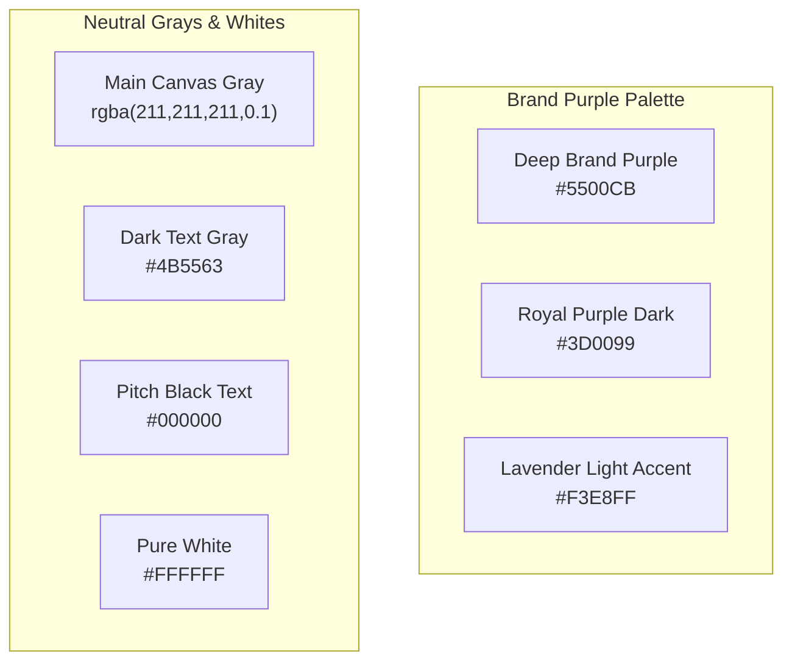

# MyRaaha Landing Page Typography & Color System Specification

This document details the complete typography system, content style definitions, responsive overrides, and color scheme tokens used across the entire **MyRaaha Landing Page** (located in `MyRaahaLanding.tsx` and `MyRaahaLanding.css`).

---

## 1. Global Typography Foundation

The MyRaaha design system relies on a clean, premium, and geometric type system powered by a single primary font family:

*   **Primary Font Family:** `'Poppins', sans-serif`
*   **Base Font Size:** `html { font-size: 20px; }`
    > [!IMPORTANT]
    > Because the root HTML font size is set to `20px`, all standard CSS `rem` values map to a base of `20px` (e.g., `1rem = 20px`, `2rem = 40px`, `1.1rem = 22px`).
*   **Italics & Decoration:** Standard text styles explicitly enforce normal font styling (`font-style: normal !important`) for highlights and body, keeping type clean and structured.

---

## 2. Typography Hierarchy by Content Type (Desktop)

Below is the desktop hierarchy for all core landing page content types.

| Content Type | Key CSS Classes / Elements | Font Size (rem) | Font Size (px) | Font Weight | Line Height | Color Token | Notes & Aesthetics |
| :--- | :--- | :--- | :--- | :--- | :--- | :--- | :--- |
| **Hero Title** | `.hero-title` (nested in `.myraaha-hero`) | `2.75rem` | `55px` | `600` (Semibold) | `1.1` | `#000000` (`--myraaha-text-dark`) | Enforces sentence case. Has custom nested span colors. |
| **Section Title** | `.section-title`, `.mission-title`, `.beacon-title` | `2.2rem` | `44px` | `700` (Bold) | `1.1` | `#000000` (`--myraaha-text-dark`) | Overridden to `#ffffff` in dark/purple backgrounds. |
| **Section Subtitle / Description** | `.section-subtitle`, `.mission-subtitle`, `.beacon-subtitle` | `1.1rem` | `22px` | `400` (Regular) | `1.6` | `#4b5563` (`--myraaha-text-gray`) | Overridden to `#ffffff` with `0.8` opacity in dark sections. |
| **Capsule Heading (Badges)** | `.section-badge`, `.mission-badge`, `.hero-badge` | `0.8rem` | `16px` | `700` (Bold) | `1.0` (inline) | `#5500CB` (`--myraaha-blue`) | All-caps, background `#f3e8ff`, letter-spacing `0.1em`. |
| **Card Title** | `h3` (inside `.service-card`, `.stakeholder-card`, etc.) | `1.45rem` / `29px` (from Tailwind config) | `29px` | `600` (Semibold) | `1.3` to `1.39` | `#000000` (`--myraaha-text-dark`) | Overridden to `#ffffff` in dark sections (e.g., Mission). |
| **Hero Subtitle Highlight** | `.hero-subtitle-highlight` | `1.4rem` | `28px` | `500` (Medium) | `1.4` (inline) | `#ffffff` | Background `#5500cb`, rounded pill (`99px`), horizontal spacing. |
| **Active Tab Text** | `.stakeholder-tab.active` | `0.95rem` | `19px` | `600` (Semibold) | `1.0` | `#5500cb` (`--myraaha-blue`) | Background `#ffffff` (desktop), border `#f1f5f9`, shadow. |
| **Inactive Tab Text** | `.stakeholder-tab` | `0.95rem` | `19px` | `600` (Semibold) | `1.0` | `#4b5563` (`--myraaha-text-gray`) | Background `transparent` (desktop), smooth color transition. |
| **Button Text (Primary)** | `.btn-primary`, `.btn-purple`, `.btn-beacon-explore` | `1.0rem` | `20px` | `600` (Semibold) | `1.2` | `#5500cb` (`--myraaha-blue`) | Background `#f3e8ff` (lavender), border-radius `14px`. |
| **Button Text (Secondary)** | `.btn-secondary`, `.btn-white` | `1.0rem` | `20px` | `600` (Semibold) | `1.2` | `#000000` (`--myraaha-text-dark`) | Background `rgba(211, 211, 211, 0.1)`, border `#e2e8f0`. |

---

## 3. Premium Interactive Elements & Card Layouts

The landing page features beautifully tailored, interactive visual containers:

### A. Capsule Headings & Section Badges
*   **Styling:** Solid pastel background `#f3e8ff`, deep violet text `#5500CB`, uppercase text transformation, letter spacing of `0.1em`, and fully rounded pill borders (`border-radius: 99px !important`).
*   **Special Contrast Override:** In dark-purple sections (e.g., the Mission section), these badges are strictly styled with `background: #f3e8ff !important` and `color: #5500cb !important` to ensure legible, premium contrast.

### B. Cards System
*   **Mission Cards:**
    *   *Background:* `rgba(255, 255, 255, 0.05)` (glassmorphism on dark vertical gradient).
    *   *Border:* `1px solid rgba(255, 255, 255, 0.1)`.
    *   *Hover Micro-Animation:* Translates `translateY(-8px)` upwards, background shifts to `rgba(255, 255, 255, 0.08)`.
    *   *Corner Radius:* `32px`.
*   **Service Cards:**
    *   *Background:* `rgba(211, 211, 211, 0.1)` (main off-white theme).
    *   *Box Shadow:* Soft shadow `0 10px 30px rgba(0,0,0,0.05)`.
    *   *Hover Micro-Animation:* Translates `translateY(-10px)` upwards, box shadow grows into a purple glow `0 20px 40px rgba(85, 0, 203, 0.08)`.
    *   *Corner Radius:* `32px` (desktop) / `12px` (mobile).
*   **Stakeholder Cards:**
    *   *Background:* `rgba(211, 211, 211, 0.1)` with light borders `1px solid #f1f5f9`.
    *   *Hover Micro-Animation:* Translates `translateY(-12px)` upwards, border glows violet `rgba(85, 0, 203, 0.15)`, box shadow `0 30px 60px rgba(85, 0, 203, 0.1)`. A thin, colorful top border gradient (`--myraaha-gradient`) fades in.
    *   *Corner Radius:* `32px`.
*   **Beacon Cards (Platform Map):**
    *   *Background:* `rgba(211, 211, 211, 0.1)` (desktop) / `#ffffff` (mobile card).
    *   *Hover Micro-Animation:* Translates `translateY(-8px)`.
    *   *Corner Radius:* `20px` (desktop) / `32px` (mobile).

---

## 4. Mobile & Responsive Typography Scaling

To ensure pixel-perfect legibility across all screen sizes, a robust media-query scaling system is implemented:

### A. Headings Scaling (Hero, Section, Mission, and Platform titles)
*   **Standard Mobile Viewport (`<= 768px`):** Scaled down to `32px !important` (line height `1.2`, weight `700`).
*   **Narrow Mobile Viewport (`<= 480px`):** Scaled down to `28px !important`.
*   **Ultra-Narrow Viewport (`<= 320px`):** Scaled down to `24px !important`.
*   **Mini Viewport (`<= 290px`):** Scaled down to `1.65rem` / `1.8rem` (approx `33px`-`36px` depending on inheritance).

### B. Other Core Text Types on Mobile
*   **Card Titles (`h3`):** Scaled down to `20px !important` (line-height `1.3`, weight `600`).
*   **Body & Description Text (`p`):** Scaled down to `1.05rem !important` (approx `21px`, line-height `1.6`, weight `400`).
*   **Hero Subtitle Highlight:** Scales to `1.2rem !important` (tablet/1024px), down to `1.15rem` (768px), and down to `0.85rem` (290px) to prevent layout overflows.
*   **Buttons:** Min-height is set to touch-safe `48px !important` (primary) and `44px !important` (secondary). Corner radius adjusts to `8px` or `16px` for touch ergonomics.

---

## 5. Background Colors & Core Color Scheme

The MyRaaha platform implements a sleek, high-fidelity color scheme dominated by elegant shades of purple and neutral gray tones.

### A. Core Hex Token Registry
1.  **Primary Brand Purple (`--myraaha-blue`):** `#5500CB`
    *   Used for active tabs, highlight words, secondary text icons, and primary button hover states.
2.  **Brand Purple Dark (`--myraaha-blue-dark`):** `#3D0099`
    *   Used in the vertical gradient background of the Mission and CTA sections.
3.  **Lavender Light Accent (`--myraaha-blue-light` / `lightestPurple`):** `#F3E8FF`
    *   Used for badges, tags, primary button backgrounds, and highlight words in dark backgrounds.
4.  **Brand Gradient (`--myraaha-gradient`):** `linear-gradient(135deg, #5500CB 0%, #7c3aed 100%)`
    *   A vibrant purple-to-violet linear gradient used for accent highlights and active indicators.
5.  **Pitch Black (`--myraaha-text-dark`):** `#000000`
    *   Enforces premium readability for all primary headings, titles, and card headers.
6.  **Slate / Gray (`--myraaha-text-gray` / `textSecondary`):** `#4B5563`
    *   Used for description text, card paragraphs, and inactive metadata.
7.  **Main Canvas BG (`--myraaha-bg-grey`):** `rgba(211, 211, 211, 0.1)`
    *   A very subtle, translucent light-gray tone with 10% opacity, providing a clean, elegant layout backing.

### B. Background Layout Hierarchy of Landing Page Sections
*   **Hero Section:** Background is the translucent `--myraaha-bg-grey` superimposed with a precise radial dotted grid: `radial-gradient(#e2e8f0 1px, transparent 1px)` sized at `40px 40px`.
*   **Mission Section:** A deep, premium vertical gradient from `#3D0099` to `#5500CB`. Behind it, three soft blur blobs (`#5500CB`, `#7c3aed`, and `#a78bfa` with `0.05` opacity) float dynamically under a dotted mesh pattern.
*   **Services Section:** `--myraaha-bg-grey`.
*   **Stakeholders Section:** `--myraaha-bg-grey` with a white stakeholder filter tab navigation block.
*   **Beacon Section (The Platform):** `--myraaha-bg-grey` with standard white layout cards on mobile to highlight depth.
*   **Newsletter Section:** Uses a custom, soft lavender panel nested on a clean background.
*   **Footer Section:** Uses a solid purple canvas matching `#5500CB` with stark white text links and social circles.
