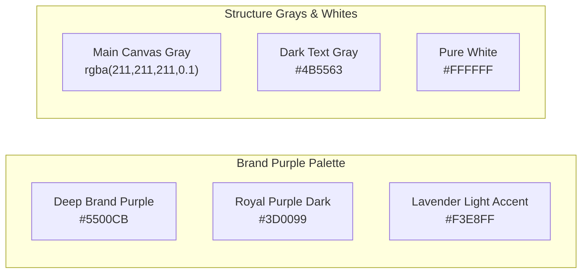
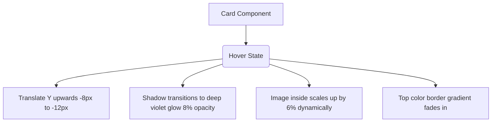

# MyRaaha Landing Website Design System & Brand Guidelines

This document serves as the master styling guide and brand guideline specification for the entire **MyRaaha Landing Website** suite. It covers all core landing pages, including the Main Landing, About, Services, Partnerships, Insights, Careers, Contact, and Legal sections.

---

## 1. Global Typography Foundation

The MyRaaha design system enforces a premium, geometric type system built around a single primary font family:

*   **Primary Font Family:** `'Poppins', sans-serif`
*   **Import Reference:** `@import url('https://fonts.googleapis.com/css2?family=Poppins:wght@300;400;500;600;700&display=swap');`
*   **Base Reading Size:** `html { font-size: 20px; }`
    > [!IMPORTANT]
    > Because the root HTML font size is set to `20px`, all standard CSS `rem` values map to a base of `20px` (e.g., `1rem = 20px`, `2rem = 40px`, `1.1rem = 22px`).
*   **Text Transformation Safeguard:** All key headings and subtitles explicitly enforce sentence-case styling (`text-transform: none !important`) and reset custom italicization to normal (`font-style: normal !important`) for highlights, ensuring a modern, polished editorial aesthetic.

---

## 2. Typography Scale Hierarchy (Desktop)

| Class / Element | Tailwind Token | Font Size (rem) | Font Size (px) | Font Weight | Line Height | Color Token / Application |
| :--- | :--- | :--- | :--- | :--- | :--- | :--- |
| **Main Hero Title** | `text-hero` | `3.5rem` | `70px` | `700` (Bold) | `1.1` | `#ffffff` (Standard Page Hero) or `#000000` (Main Landing) |
| **Section Title** | `text-section-opener` | `2.2rem` | `44px` | `700` (Bold) | `1.1` | `#000000` (`--myraaha-text-dark`) |
| **Reflective / Subtitle** | `text-reflective` | `2.0rem` | `40px` | `400` (Regular) | `1.3` | `#4b5563` (`--myraaha-text-gray`) |
| **Header 1 (H1)** | `text-h1` | `2.5rem` | `50px` | `700` (Bold) | `1.1` | `#000000` / slate-800 |
| **Header 2 (H2)** | `text-h2` | `2.0rem` | `40px` | `700` (Bold) | `1.15` | Slate-800 |
| **Header 3 (H3 / Cards)** | `text-h3` | `1.45rem` | `29px` | `600` (Semibold) | `1.3` | `#000000` (`--myraaha-text-dark`) |
| **Body Primary** | `text-body-primary` | `1.0rem` | `20px` | `400` (Regular) | `1.6` | `#4b5563` (`--myraaha-text-gray`) |
| **Body Long / Paragraphs** | `text-body-long` | `1.0rem` | `20px` | `400` (Regular) | `1.8` | `#4b5563` (`--myraaha-text-gray`) |
| **Body Secondary** | `text-body-secondary` | `0.9rem` | `18px` | `400` (Regular) | `1.6` | Gray-600 / Metadata labels |
| **Input / Prompt Text** | `text-prompt` | `1.1rem` | `22px` | `400` (Regular) | `1.5` | Forms and dynamic inputs |
| **Pills & Badges** | `text-micro-guidance` | `0.8rem` | `16px` | `700` (Bold) | `1.0` (inline) | `#5500CB` (`--myraaha-blue`), Uppercase, letter-spacing `0.1em` |
| **UI Button Text** | `text-ui-button` | `1.0rem` | `20px` | `600` (Semibold) | `1.2` | Action button text labels |
| **UI Navigation Link** | `text-ui-nav` | `0.95rem` | `19px` | `500` (Medium) | `1.4` | Navbar links |

---

## 3. Brand Color Registry

The color scheme features high-fidelity purple tones supported by soft canvas grays and crisp white cards:

### A. Core Hex Tokens

*   **Primary Brand Purple (`--myraaha-blue`):** `#5500CB`
    *   *Usage:* Highlights, active navigation states, accent icons, and primary buttons.
*   **Brand Purple Dark (`--myraaha-blue-dark`):** `#3D0099`
    *   *Usage:* Backings for primary banners, background gradients, and footer panels.
*   **Lavender Light Accent (`--myraaha-blue-light`):** `#F3E8FF`
    *   *Usage:* Capsule badges, tags, primary button backgrounds, and card overlays.
*   **Primary Brand Gradient (`--myraaha-gradient`):** `linear-gradient(135deg, #5500CB 0%, #7c3aed 100%)`
    *   *Usage:* Standard page heroes, decorative borders, active indicators, and sign-up CTAs.
*   **Main Canvas BG (`--myraaha-bg-grey`):** `rgba(211, 211, 211, 0.1)`
    *   *Usage:* Global page background. Gives a modern, off-white translucent texture.
*   **Text Dark (`--myraaha-text-dark`):** `#000000` (and Slate-800 `#1e293b` for general headings).
*   **Text Gray (`--myraaha-text-gray`):** `#4b5563`.

### B. High-Contrast Enforcement Rule
To guarantee premium readability across both light and dark regions:
1.  **Dark Purple Zones:** (e.g., Mission, CTA, standard page heroes, and footers):
    *   All nested headers and paragraphs are strictly forced to white (`#ffffff !important`).
    *   Span highlights in dark areas use **Light Lavender (`#f3e8ff !important`)** instead of the standard brand purple.
2.  **Light/Translucent Zones:** (e.g., Services, Stakeholders, and Careers):
    *   Headers are forced to Black (`#000000 !important`).
    *   Span highlights use **Brand Purple (`#5500cb !important`)**.

---

## 4. Page Layouts & Structural Background Hierarchy

*   **Main Landing Page (`MyRaahaLanding.tsx`):**
    *   *Hero Section:* Main Canvas BG (`--myraaha-bg-grey`) with a radial grid backing: `radial-gradient(#e2e8f0 1px, transparent 1px)` sized at `40px 40px`.
    *   *Mission Section:* Solid deep gradient from `#3D0099` to `#5500CB` with glowing blurred gradient circles (blurs up to `100px`) animated to float slowly.
    *   *Services Section:* Main Canvas BG with off-white cards.
    *   *Stakeholder Section:* Main Canvas BG with a white background filter tab block (`#f8fafc`).
    *   *Beacon Section:* Main Canvas BG with standard white grids on mobile.
*   **About Page (`MyRaahaAbout.tsx`):**
    *   *Strategic Framework Mosaic:* Clean, premium grid boxes featuring dark-gray outlines, subtle stat bars (`LFPR` comparison from 55% to 70%), and full-width imagery overlays.
    *   *Timeline (Journey):* Vertical line centered on desktop (`left: 50%`) and aligned left on mobile (`left: 20px`), decorated with glowing purple timeline dots and numbered steps.
*   **Services Page (`MyRaahaServices.tsx`):**
    *   *Alternating Feature Layouts:* Side-by-side splits with large rounded visuals and detailed bullet lists.
*   **Partnerships Page (`MyRaahaPartnerships.tsx`):**
    *   *Dynamic Path (Timeline):* Center-aligned dotted path with colorful input-output indicator tags (`io-tag`) reflecting inputs (`#3b82f6`) and outputs (`#5500cb`).

---

## 5. Premium Cards & Micro-Animations

The design system incorporates elegant micro-interactions to create a highly responsive experience:

### A. Card Styles
*   **Service Cards:** Rounded corners (`32px`), soft shadow (`0 10px 30px rgba(0,0,0,0.05)`). On hover, translates `translateY(-10px)` with a purple shadow glow: `0 20px 40px rgba(85, 0, 203, 0.08)`.
*   **Stakeholder Cards:** Features a thin color border gradient (`--myraaha-gradient`) that fades in from the top on hover, along with a `translateY(-12px)` lift.
*   **Mission Cards:** Glassmorphic layout styled with `rgba(255, 255, 255, 0.05)` backing and thin borders `1px solid rgba(255, 255, 255, 0.1)`.

### B. Global Image Radius
*   All visual media and images (except navigation logos) are universally rounded to a corner radius of **`20px`** (or **`32px`** on hero banners) to maintain a soft, friendly aesthetic.

---

## 6. Icons & Navigation Details

### A. Icon Tokens (Lucide React)
*   **Main Landing:** `Globe`, `Rocket`, `Handshake`, `Lightbulb`, `MessageSquare`, `Target`, `Layout`, `Users`, `Workflow`, `Compass`, `Briefcase`, `ShieldCheck`, `TrendingUp`, `Award`, `ArrowRight`.
*   **Sizing Rules:**
    *   *Hero features:* `w-5 h-5` / `w-6 h-6` (20px / 24px) for inline items.
    *   *Card Headers:* `w-6 h-6` (24px) nested in a container size of `48px x 48px` or `56px x 56px`.
    *   *Mission banners:* Large `w-8 h-8` (32px) white stroke icons.
*   **Coloring Rules:** Icons inside light cards are styled with `color: var(--myraaha-blue)` or matching status tokens (pink, light-blue, yellow highlights). Inside dark purple sections, icons are forced to `#ffffff`.

### B. Header & Navbar
*   **Style:** Glassmorphic fixed bar with `80px` height, translucent background `rgba(255, 255, 255, 0.85)` with a backdrop blur of `12px`, and a bottom border `1px solid rgba(85, 0, 203, 0.08)`.
*   **Auth Buttons:**
    *   *Login:* Text link styled with Poppins `0.95rem`, bold weight `600`, color `#5500cb`.
    *   *Sign Up:* Solid pill button styled with `var(--myraaha-gradient)` backing, white text, and a soft drop shadow `0 4px 15px rgba(85, 0, 203, 0.15)`.

---

## 7. Responsive Breakpoints & Mobile Scaling

To guarantee readability across all viewports, font sizes and touch targets scale dynamically:

### A. Responsive Breakpoints
*   **Desktop Standard:** `>= 1024px`
*   **Tablet / Large Mobile:** `< 1024px` and `>= 768px`
*   **Mobile Standard:** `< 768px`
*   **Narrow Mobile:** `< 480px`
*   **Ultra-Narrow Mobile:** `< 320px`

### B. Mobile Conversions
*   **Main Headings (Hero, Section Titles):** Scales from `3.5rem` / `2.75rem` down to `2.25rem` / `32px` (standard mobile), and down to `28px` (narrow mobile).
*   **Card Headings (H3):** Scales down to `20px` (`1rem` mapping).
*   **Subtitles & Paragraphs:** Scales down to `1.05rem` (`21px`) or `0.95rem` (`19px`) with a line height of `1.6`.
*   **Touch Targets (Buttons):** Min-height is set to a safe **`48px !important`** (primary buttons) and **`44px !important`** (secondary buttons).
*   **Hero Highlights:** The subtitle pill (`.hero-subtitle-highlight`) adjusts from desktop `white-space: nowrap` to mobile `white-space: normal` with automatic margins (`margin: 15px auto 2.5rem auto`) to prevent screen clipping.
